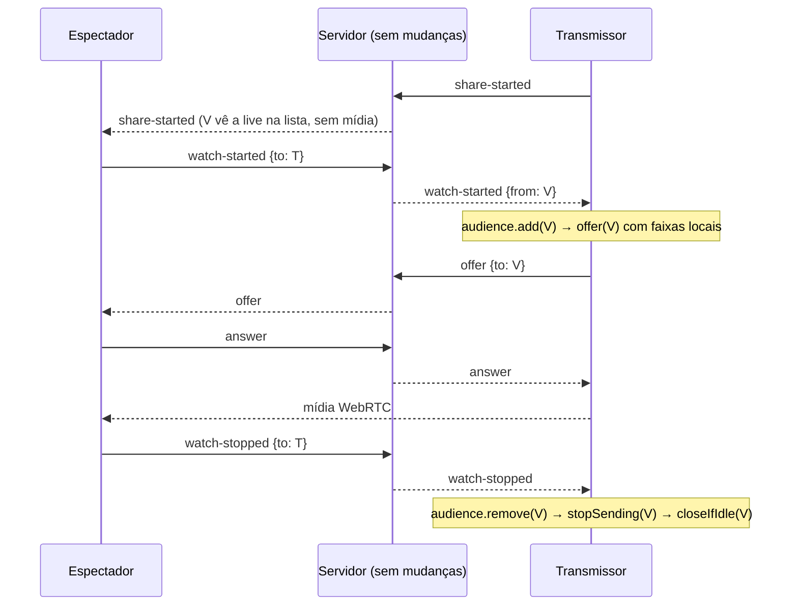
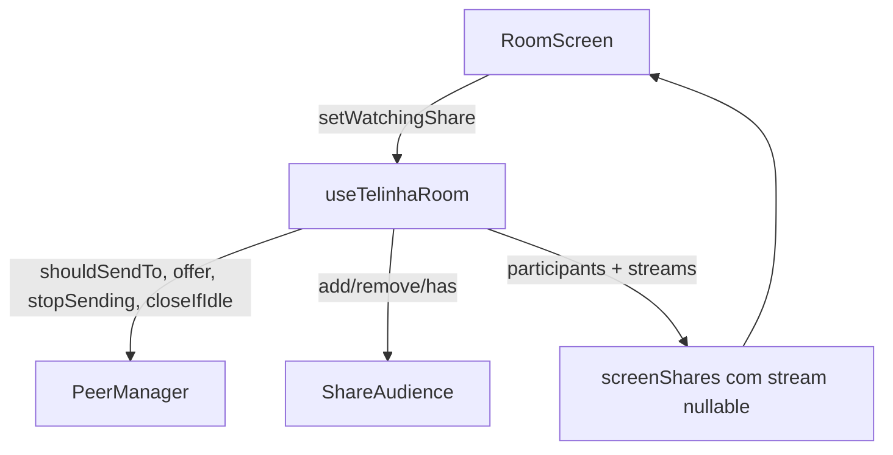

# On-Demand Media Design

**Spec**: `.specs/features/on-demand-media/spec.md`
**Status**: Draft

---

## Architecture Overview

Hoje a presença de mídia define o que a UI mostra (`screenShares` vem das streams recebidas) e o transmissor oferece a todos. O novo modelo separa três coisas:

1. **Quem está ao vivo** vem de `participants` (flag `sharing` do servidor), independente de mídia.
2. **Quem recebe mídia de mim** é a **audiência** (`ShareAudience`): quem enviou `watch-started` e ainda não parou.
3. **Quem eu assisto** é um conjunto local (`watchingRef`), alimentado por `setWatchingShare`.

O `PeerManager` passa a só enviar faixas locais a peers da audiência (`shouldSendTo`) e ganha operações para parar de enviar e fechar conexões ociosas.





---

## Code Reuse Analysis

### Existing Components to Leverage

| Component | Location | How to Use |
| --- | --- | --- |
| `PeerManager.offer`, `ensure`, `syncLocalTracks` | `src/room/peerManager.ts` | Estender: `syncLocalTracks` passa a consultar `shouldSendTo` |
| `removeLocalTracks` | `src/room/peerManager.ts:123` | Base para `stopSending` (versão por peer) |
| `watchersRef` + `publishWatchers` | `src/hooks/useTelinhaRoom.ts` | Substituir por `ShareAudience`; a forma publicada (`watcherCounts[localId]`) permanece |
| `offerTo`, `closePeer` | `src/hooks/useTelinhaRoom.ts` | Chamados só para membros da audiência |
| `addWatching`, `removeWatching`, `pruneWatching` | `src/lib/watch.ts` | Intocados; `pruneWatching` passa a receber ids de lives, não de streams |
| `MockPeerConnection` | `src/room/peerManager.test.ts` | Base dos testes de `shouldSendTo`/`stopSending` (estender `removeTrack`) |
| `recordDiagnostic` | `src/lib/diagnostics.ts` | `audience-change`, `audience-offer-failed` |
| E2E sintético | `e2e/room-flow.spec.ts`, `src/media/displayShare.ts` | Base do E2E de 3 clientes |

### Integration Points

| System | Integration Method |
| --- | --- |
| Servidor / protocolo | Nenhuma mudança; usa `watch-started`/`watch-stopped` existentes (entregues só ao alvo) |
| `RoomScreen` | Passa a tolerar `share.stream === null` (estado "conectando") |
| E2E | Acesso a `peerIds()` por hook de debug **só** com `VITE_E2E_MEDIA=1` em dev |

---

## Components

### ShareAudience (novo, puro)

- **Purpose**: Conjunto de espectadores atuais da live local, com idempotência.
- **Location**: `src/room/shareAudience.ts`
- **Interfaces**:
  - `add(id: string, name: string): "added" | "updated"`
  - `remove(id: string): boolean`
  - `has(id: string): boolean`
  - `ids(): string[]`
  - `names(): string[]`
  - `clear(): void`
  - `readonly size: number`
- **Dependencies**: nenhuma
- **Reuses**: forma de `Map<string, string>` de `watchersRef`

### PeerManager (modificado)

- **Purpose**: Gerenciar conexões enviando faixas só a quem deve recebê-las.
- **Location**: `src/room/peerManager.ts`
- **Interfaces** (novas):
  - opção `shouldSendTo(peerId: string): boolean`
  - `peerIds(): string[]`
  - `stopSending(peerId: string): Promise<void>`: remove as faixas locais da conexão e renegocia
  - `closeIfIdle(peerId: string): boolean`: fecha se não há faixa enviada nem recebida ativa; retorna se fechou
- **Regras**: `syncLocalTracks(peerId, …)` só adiciona faixas se `shouldSendTo(peerId)`; operações no mesmo peer (`offer`, `stopSending`) executam em série (cadeia de promises por peer).
- **Dependencies**: opções do hook
- **Reuses**: `ensure`, `offer`, `removeLocalTracks`, `markVideoMotion`

### useTelinhaRoom (modificado)

- **Purpose**: Orquestrar audiência, lista de lives e recuperação.
- **Location**: `src/hooks/useTelinhaRoom.ts`
- **Mudanças**:
  - `ScreenShareInfo.stream: MediaStream | null`; `publishShares` itera `peopleRef` (remotos com `isSharing`), anexando a stream quando existe; mantém a entrada local.
  - `offerToEveryone` removido de `hello`, `participant-joined` e `participant-presence`; substituído por `offerToAudience()`.
  - `watch-started` (`to === localId`): valida (transmitindo, `from` conhecido e conectado) → `audience.add` → se `"added"` ou conexão ausente/fechada, `offerTo(from)`.
  - `watch-stopped` / presença desconectada de um espectador / `participant-left`: `audience.remove` → `stopSending` → `closeIfIdle`.
  - `stopShare`: `audience.clear()`; `stopSending` em todos; `closeIfIdle` em cada peer.
  - `watchingRef: Set<string>` mantido em `setWatchingShare`; usado em `hello` e presença para reenviar `watch-started`, e para decidir `closeIfIdle` ao parar de assistir.
  - Temporizador de "sem stream" por transmissor assistido (função pura em `lib/watch.ts`).
  - Em E2E (`VITE_E2E_MEDIA=1`, só dev): `window.__telinhaDebug = { peerIds }`.
- **Dependencies**: `ShareAudience`, `PeerManager`
- **Reuses**: `publishPeople`, `publishWatchers`, `sendSignal`

### VideoTile / RoomScreen (modificados)

- **Purpose**: Exibir estado "conectando" quando a stream ainda não chegou.
- **Location**: `src/components/VideoTile.tsx`, `src/screens/RoomScreen.tsx`
- **Interfaces**: `share.stream` pode ser `null`; nesse caso, mostra o placeholder e **não** monta `<video>`.
- **Reuses**: classes CSS existentes (`.watch-pane`); texto novo em português.

### buildScreenShares (novo, puro)

- **Purpose**: Montar a lista `ScreenShareInfo[]` a partir de pessoas, streams remotas e stream local, sem depender de React.
- **Location**: `src/room/screenShares.ts`
- **Interfaces**:
  - `buildScreenShares(input: { localId: string; people: Iterable<RoomPerson>; remoteStreams: ReadonlyMap<string, MediaStream>; localStream: MediaStream | null; localSharing: boolean }): ScreenShareInfo[]`
- **Regras**: remoto entra se `isSharing` (stream = a recebida ou `null`); stream recebida de quem não está mais em `people`/`isSharing` é descartada; entrada local só se `localSharing && localStream`.
- **Reuses**: lógica atual de `publishShares` (`useTelinhaRoom.ts:128`)

### watchRetry (novo, puro, em `lib/watch.ts`)

- **Purpose**: Decidir, a partir do tempo desde `watch-started` e da presença de stream, entre `"wait" | "resend" | "fail"`.
- **Interfaces**: `nextWatchAction(elapsedMs: number, resent: boolean, hasStream: boolean): "idle" | "wait" | "resend" | "fail"`
- **Reuses**: arquivo `lib/watch.ts` e seus testes (`watch.test.ts`)

---

## Data Models

```typescript
interface ScreenShareInfo {
  participantIdentity: string;
  participantName: string;
  stream: MediaStream | null; // null enquanto nenhuma faixa chegou
}
```

**Relationships**: `screenShares` = remotos com `isSharing` (de `peopleRef`) + entrada local. `ShareAudience` ⊆ pessoas conectadas.

---

## Error Handling Strategy

| Error Scenario | Handling | User Impact |
| --- | --- | --- |
| `offer` ao espectador falha | `recordDiagnostic("audience-offer-failed")`; espectador permanece na audiência | Espectador vê "conectando" e, após o retry de ONDEM-18, o erro |
| `watch-started` perdido | Reenvio 1× após 10 s (ONDEM-18) | "Conectando…" por até ~10 s |
| Transmissor ainda não transmitindo ao receber `watch-started` | Ignorado (ONDEM-06) | Coberto pelo reenvio |
| `stopSending` durante `offer` em andamento | Serializado por peer (ONDEM-14) | Nenhum |

---

## Risks & Concerns

| Concern | Location (file:line) | Impact | Mitigation |
| --- | --- | --- | --- |
| `ensure()`/`handleDescription()` chamam `syncLocalTracks` e hoje enviam faixas a qualquer conexão nova | `src/room/peerManager.ts:251`, `:95` | Vazar vídeo para quem não assiste (quebra ONDEM-04) mesmo com a oferta gated | `shouldSendTo` por peer dentro de `syncLocalTracks` (T2); teste cobrindo conexão criada por oferta recebida |
| Lista de lives deriva de streams recebidas | `src/hooks/useTelinhaRoom.ts:128-146`, `src/screens/RoomScreen.tsx:91-101` | Sem mídia automática ninguém veria lives; toasts "live/ended" e `pruneWatching` também dependem disso | Trocar a fonte para `participants` (T3/T5) **antes** de desligar o envio eager (T6) |
| Hook de 800 linhas sem testes unitários (vitest em ambiente `node`, sem DOM) | `src/hooks/useTelinhaRoom.ts` | Regressões de orquestração só aparecem no E2E | Extrair lógica pura (`ShareAudience`, `nextWatchAction`) com testes 1:1 com os ACs; hook coberto por E2E |
| Sem compatibilidade entre versões do app | `server/src/protocol.ts` (`CURRENT_PROTOCOL_VERSION`) | Espectador antigo não vê lives de transmissor novo | Aceito como decisão (Assumptions); o mantenedor sobe `MIN_APP_VERSION` ao publicar; registrar no PR |
| Perfect negotiation com renegociação por `removeTrack` | `src/room/peerManager.ts:74-102` | Colisão de ofertas se os dois lados mudam ao mesmo tempo | Já tratada por `polite`/rollback; adicionar teste de `stopSending` em colisão (T7) |
| Conexão fechada cedo demais em par bidirecional | `closePeer` em `participant-presence`/`share-stopped` | Cortar a direção ainda ativa | `closeIfIdle` considera as duas direções (T8) |

---

## Tech Decisions

| Decision | Choice | Rationale |
| --- | --- | --- |
| Quem oferece | Transmissor, ao receber `watch-started` | Mantém o fluxo atual; evita invertê-lo |
| Parar de enviar | `removeTrack` + renegociação | Permite fechar conexão ociosa; `replaceTrack(null)` manteria m-line e a conexão |
| Onde fica a lógica testável | Módulos puros (`ShareAudience`, `nextWatchAction`) | O repo não tem infraestrutura de teste de hooks/DOM; evita adicionar dependências |
| Acesso do E2E aos peers | `window.__telinhaDebug.peerIds()` só com `VITE_E2E_MEDIA=1` em dev | Verifica "0 peers para quem não assiste" sem expor nada em produção |
| Estado "assistindo" | `watchingRef` no hook, alimentado por `setWatchingShare` | `RoomScreen` já chama `setWatchingShare` nas transições; evita nova API |

> Nenhuma decisão aqui é de projeto inteiro; não é necessário registrar em `.specs/STATE.md`, exceto a de **não manter compatibilidade entre versões**, que deve ser confirmada com o mantenedor.
