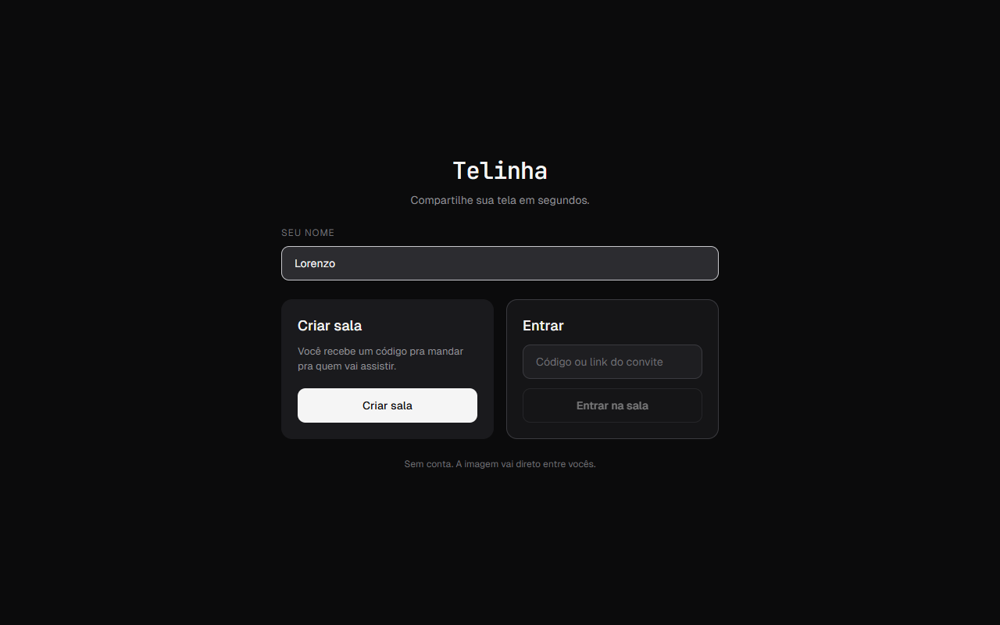
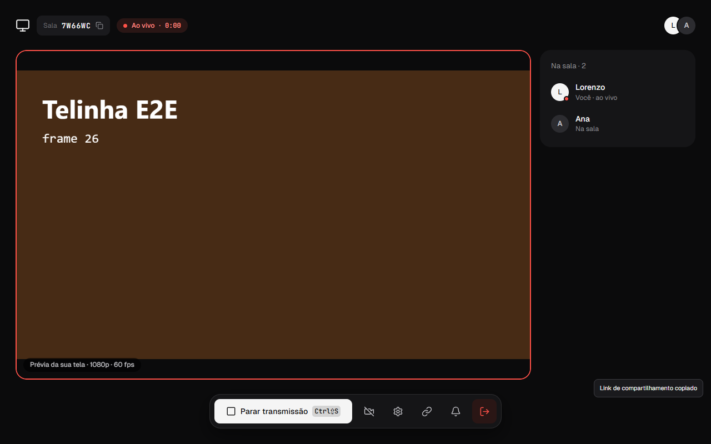
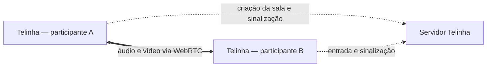

<p align="center">
  
</p>

<h1 align="center">Telinha</h1>

<p align="center">
  Compartilhamento de tela P2P para Windows, sem conta e sem complicação.
</p>

<p align="center">
  <a href="https://github.com/llorenzocardoso/telinha/actions/workflows/ci.yml"></a>
  <a href="LICENSE"></a>
  
  
</p>

O Telinha cria salas temporárias por código para compartilhar e assistir telas em uma janela leve. O áudio e o vídeo trafegam entre os participantes por WebRTC; o servidor cuida apenas da criação das salas e da sinalização necessária para estabelecer as conexões.

## Visão geral

| Início | Transmissão |
| --- | --- |
|  |  |

### Principais recursos

- salas temporárias com código de seis caracteres;
- entrada sem cadastro, usando apenas um nome;
- compartilhamento de tela com captura e codificação pelo Chromium;
- áudio do sistema por loopback nativo no app Windows;
- câmera opcional, junto ou separada da tela, com escolha da câmera padrão;
- mais de uma transmissão simultânea, com visualização em grade;
- reconexão automática e recuperação de sessões recentes;
- indicadores de qualidade da conexão e diagnóstico local sanitizado;
- atalhos globais, bandeja do sistema e deep links.

## Como funciona

1. Uma pessoa cria a sala e compartilha o código.
2. Os demais participantes entram com esse código e um nome.
3. Qualquer participante pode iniciar uma transmissão com **Compartilhar tela** ou `Ctrl+Shift+S`.
4. O seletor nativo do WebView2 escolhe a janela ou o monitor, e o WebRTC conecta os participantes.



O servidor de sinalização não recebe o conteúdo da tela. Quando uma conexão direta não é possível, um servidor TURN pode retransmitir a mídia, que continua protegida pelo transporte do WebRTC.

## Instalação

1. Acesse a página de [Releases](https://github.com/llorenzocardoso/telinha/releases).
2. Baixe o instalador `.exe` ou `.msi` mais recente.
3. Instale e abra o Telinha no Windows.

O projeto ainda está em desenvolvimento ativo. Caso não exista uma release pública, use as instruções de desenvolvimento abaixo.

## Desenvolvimento local

### Pré-requisitos

- Windows 10 ou 11;
- [Node.js](https://nodejs.org/) 20 ou superior;
- [Rust](https://rustup.rs/) com o toolchain MSVC;
- Microsoft Edge WebView2 Runtime.

### Preparação

```powershell
git clone https://github.com/llorenzocardoso/telinha.git
Set-Location telinha
npm ci
npm ci --prefix server
Copy-Item .env.example .env
Copy-Item server/.env.example server/.env
```

Para iniciar o servidor e o aplicativo desktop juntos:

```powershell
npm run dev:all
```

Para testar somente a interface web com duas janelas do navegador:

```powershell
npm run dev:solo
```

Abra `http://127.0.0.1:1420` em duas janelas anônimas separadas. No navegador, deixe o áudio do sistema desativado: o loopback nativo existe apenas no aplicativo Windows.

### Variáveis de ambiente

| Variável | Onde | Finalidade |
| --- | --- | --- |
| `VITE_API_URL` | aplicativo | URL HTTP pública do servidor de sinalização |
| `VITE_ALLOW_LOCAL_API` | aplicativo | permite gerar um build de produção apontando para localhost quando vale `1` |
| `VITE_TURN_URL` | aplicativo | URL de um servidor TURN próprio |
| `VITE_TURN_USERNAME` | aplicativo | usuário do TURN próprio |
| `VITE_TURN_CREDENTIAL` | aplicativo | credencial do TURN próprio |
| `PORT` / `HOST` | servidor | endereço em que o servidor HTTP escuta |
| `WS_PUBLIC_URL` | servidor | URL pública fixa do WebSocket |
| `TRUST_PROXY` | servidor | habilita confiança no primeiro proxy quando vale `1` |
| `CORS_ORIGINS` | servidor | origens web adicionais, separadas por vírgula |
| `MIN_PROTOCOL_VERSION` | servidor | menor versão do protocolo aceita pelo HTTP e WebSocket |
| `MIN_APP_VERSION` | servidor | menor versão do app aceita; abaixo dela a pessoa vê a tela de atualização |
| `CLOUDFLARE_TURN_KEY_ID` | servidor | chave do Cloudflare Realtime TURN; sem ela o servidor entrega só STUN |
| `CLOUDFLARE_TURN_API_TOKEN` | servidor | token do Cloudflare Realtime TURN |
| `CLOUDFLARE_TURN_TTL_SECONDS` | servidor | validade das credenciais TURN em segundos (padrão `3600`, máximo `86400`) |
| `TURN_ENABLED` | servidor | ligado por padrão; `0`, `false`, `off` ou `no` desligam o relay e entregam só STUN |
| `TURN_MAX_BITRATE_KBPS` | servidor | teto de vídeo em kbps quando a rota é relay; vazio significa sem limite |

O Cloudflare TURN é cobrado por GB depois da franquia mensal gratuita, e `TURN_ENABLED` e
`TURN_MAX_BITRATE_KBPS` existem para conter esse custo sem mexer em código. Elas são lidas a cada
requisição, então basta alterar as variáveis do serviço no Render — não é no GitHub nem no app.

Três ressalvas antes de mexer:

- Salvar no Render faz redeploy, e as salas só existem na memória do servidor: todo mundo cai. Altere
  com a sala vazia.
- `TURN_ENABLED=0` vale para quem entra ou renova a conexão depois; quem já está em relay segue até a
  conexão fechar ou a credencial expirar.
- O teto de bitrate só chega a quem entra de novo usando uma versão do app que já o aplica.

Nunca versione arquivos `.env` com credenciais. O `.env.production` do repositório contém apenas a URL pública usada no build oficial.

## Testes e qualidade

```powershell
npm run lint
npm test
npm run build
npm run test:e2e

npm run lint --prefix server
npm test --prefix server
npm run build --prefix server

cargo fmt --check --manifest-path src-tauri/Cargo.toml
cargo clippy --manifest-path src-tauri/Cargo.toml --all-targets -- -D warnings
cargo test --manifest-path src-tauri/Cargo.toml
```

O CI executa lint, testes e builds de frontend e servidor, o fluxo E2E e a formatação Rust. Alterações no Tauri também ativam testes e Clippy em um runner Windows.

## Estrutura do projeto

```text
src/          interface React, WebRTC e gerenciamento das salas
server/       servidor HTTP e WebSocket de sinalização
src-tauri/    shell desktop, captura de áudio e integrações do Windows
e2e/          fluxo automatizado com Playwright e mídia sintética
.github/      CI e geração dos instaladores Windows
```

### Stack

- React 19, TypeScript e Vite;
- Tauri 2 e Rust;
- WebRTC para mídia P2P;
- Express e `ws` para sinalização;
- Vitest e Playwright para testes.

## Privacidade e diagnóstico

- não existem contas ou banco de dados;
- salas, participantes e limites de requisição ficam somente na memória do servidor;
- áudio e vídeo não passam pelo servidor de sinalização;
- o relatório de diagnóstico omite token, código da sala, nomes, SDP, candidatos ICE, IPs e endereços de rede;
- o relatório inclui apenas versão, estados de conexão, codec, volume de dados, frames e tipo de rota ICE.

## Limitações conhecidas

- o aplicativo desktop e a captura nativa de áudio são específicos do Windows;
- redes com CGNAT, firewall restritivo ou UDP bloqueado podem exigir um TURN próprio;
- o relay público configurado como fallback é uma tentativa de conectividade, não uma garantia de disponibilidade;
- as salas são efêmeras e desaparecem quando o servidor reinicia ou após o período de retenção.

## Build para Windows

```powershell
npm run build:desktop
```

Os instaladores são gerados em `src-tauri/target/release/bundle/`. Também é possível executar manualmente **Actions → Release Windows → Run workflow**; o workflow cria um draft em Releases e publica `.msi` e `.exe` como artifacts.

## Deploy do servidor

O arquivo [`render.yaml`](render.yaml) permite criar o servidor no Render. Para outro provedor, execute dentro de `server/`:

```powershell
npm ci
npm run build
npm start
```

Em produção, configure `WS_PUBLIC_URL`, `MIN_PROTOCOL_VERSION` e `TRUST_PROXY` de acordo com a infraestrutura. Para redes restritivas, forneça também um TURN próprio no build do aplicativo.

## Documentação técnica

A referência completa para desenvolvimento e operação está em [`docs/`](docs/README.md): arquitetura, protocolo de sinalização, servidor, cliente, shell desktop, guia de desenvolvimento, operação/releases e segurança.

## Contribuindo

Issues e pull requests são bem-vindos. Antes de enviar uma alteração:

1. mantenha a mudança focada e explique o comportamento afetado;
2. inclua ou atualize testes quando houver mudança de lógica;
3. execute os comandos de qualidade relevantes;
4. não inclua códigos de sala, tokens, IPs ou credenciais em logs e screenshots.

## Licença

Distribuído sob a licença [MIT](LICENSE).

Feito por [llorenzocardoso](https://github.com/llorenzocardoso).
