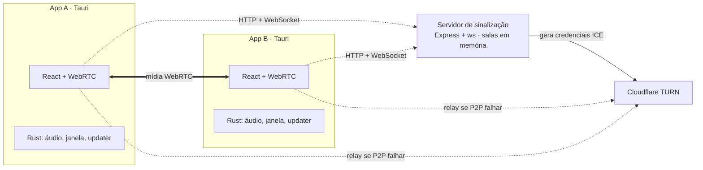
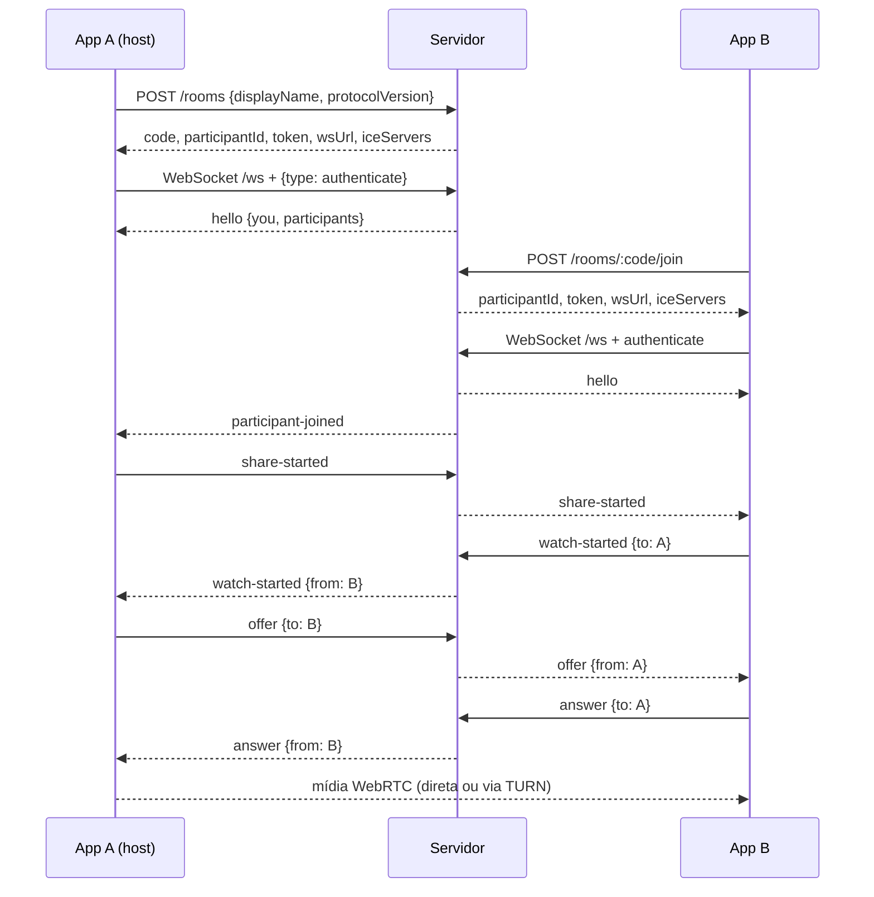
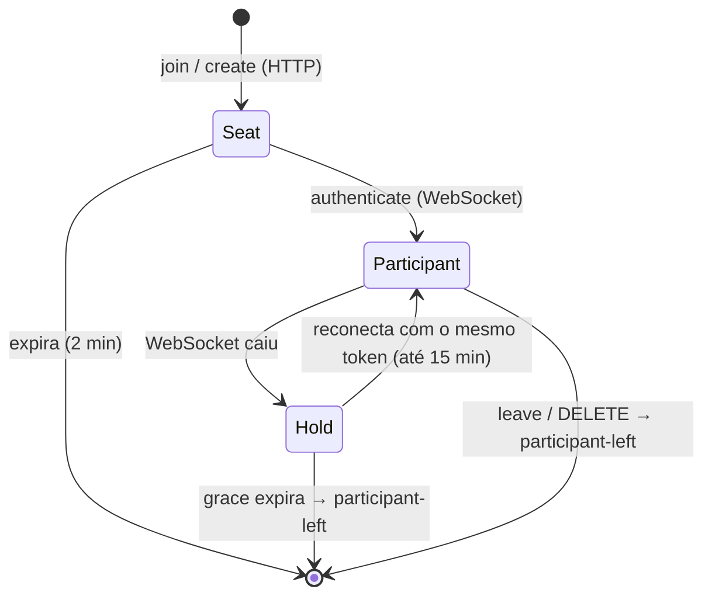
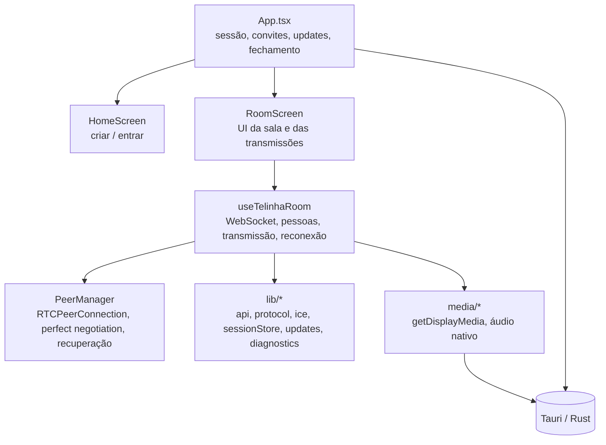

# Arquitetura

O Telinha é um app de compartilhamento de tela P2P. Três peças:

1. **App desktop** (Tauri 2 + React): captura a tela, conecta os participantes por WebRTC e exibe as transmissões.
2. **Servidor de sinalização** (Node + Express + `ws`): cria salas, emite credenciais de sessão e repassa mensagens de negociação. Não vê áudio nem vídeo.
3. **Provedor ICE** (STUN públicos e, opcionalmente, Cloudflare TURN): ajuda a atravessar NAT e serve de relay quando a conexão direta falha.

## Decisões de projeto

| Decisão | Motivo / consequência |
| --- | --- |
| **Sem contas e sem banco de dados** | Salas, sessões e limites de requisição vivem na memória do servidor. Reiniciar o servidor derruba todas as salas. Só existe uma instância (não há estado compartilhado). |
| **Malha P2P sob demanda** | O transmissor só abre `RTCPeerConnection` e envia mídia a quem pediu para assistir (`watch-started`). Quem não assiste ninguém não mantém conexão. O upload do transmissor cresce com o número de **espectadores**, não com o tamanho da sala; o limite de 16 pessoas por sala continua. |
| **Servidor só sinaliza** | O conteúdo da tela nunca passa pelo servidor. Com TURN, o relay encaminha pacotes já cifrados pelo transporte do WebRTC. |
| **Captura pelo Chromium (WebView2)** | O vídeo vem de `getDisplayMedia` (seletor nativo do WebView2) e é codificado pelo próprio WebRTC. O Rust só entra para o **áudio do sistema** (loopback WASAPI). |
| **Identidade por token de sessão** | Cada entrada na sala emite `participantId` + `token` aleatórios. O token autentica o WebSocket, a renovação de ICE e a saída. |
| **Sessão sobrevive a quedas** | Ao cair o WebSocket, o servidor "estaciona" o participante por 15 minutos e o cliente reconecta com o mesmo token. |
| **Versionamento duplo** | `protocolVersion` (compatibilidade de mensagens) e versão do app (atualização obrigatória/opcional). Ambos checados pelo servidor. |

## Ciclo de vida de uma sala

Pontos importantes:

- A entrada via HTTP cria um **seat** (assento) válido por 2 minutos. Ele só vira participante quando o WebSocket autentica com o mesmo token.
- Transmitir não envia `offer` a ninguém. A live aparece na lista de todos pela flag `sharing` (`share-started`), sem mídia.
- Quem escolhe assistir envia `watch-started`; o transmissor então entra na audiência e faz a `offer` a esse espectador. `watch-stopped` encerra o envio e, se a conexão ficar ociosa, ela é fechada. O servidor entrega esses avisos apenas ao transmissor alvo e não mudou.

## Estados de uma pessoa no servidor

## Camadas do cliente

Detalhes em [client.md](client.md), [server.md](server.md) e [desktop.md](desktop.md).

## O que existe mas não está no caminho atual

O Rust ainda expõe uma captura de vídeo por quadros JPEG (`list_share_sources`, `resolve_share_source`, `start_share_capture` com vídeo, `read_share_frame`, evento `share-frame`), e o frontend mantém `src/media/shareVideo.ts` (`createVideoSink`, `decodeShareJpeg`). **O fluxo atual não chama nada disso**: o vídeo vem de `getDisplayMedia`, e `start_share_capture` é chamado apenas com `includeVideo: false` para capturar áudio. Trate esse código como legado antes de depender dele ou de removê-lo.
