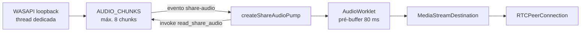

# Shell desktop (Tauri 2 + Rust)

Código em [src-tauri/](../src-tauri/). Crate `telinha` (lib `telinha_lib`), identificador `com.telinha.desktop`, janela principal `main`. Plataforma-alvo: **Windows** (WebView2). O código compila em outros sistemas, mas captura de áudio, permissões de mídia e detecção de GPU só funcionam no Windows.

## Módulos

| Arquivo | Responsabilidade |
| --- | --- |
| `src/lib.rs` | Plugins, comandos básicos, bandeja, atalho global, deep links, instância única, interceptação do fechar |
| `src/audio.rs` | Captura de áudio do sistema (WASAPI loopback) e fila de chunks PCM |
| `src/capture.rs` | Listagem de fontes, captura legada de quadros, `set_window_layout` |
| `src/gpu.rs` | Detecta GPU com encoder de hardware (para preferir H.264) |
| `src/discord.rs` | Rich Presence do Discord (opcional) |
| `src/webview_permissions.rs` | Libera câmera/microfone no WebView2 sem prompt |

## Comandos (`invoke`) e eventos

| Comando | Usado pelo frontend? | Descrição |
| --- | --- | --- |
| `copy_to_clipboard(text)` | Sim | Copia código/diagnóstico |
| `show_main_window`, `hide_main_window` | Sim | Mostrar/esconder a janela (bandeja, convites) |
| `quit_app` | Sim | Para a captura e encerra o processo |
| `set_window_layout(layout)` | Sim | `"home"`, `"watch-window"`, `"watch-dual"`, `"watch"` (tela cheia) |
| `gpu_encode_info` | Sim | `{available, vendor, name}` |
| `set_discord_presence(code)` | Sim | Define/limpa a sala exibida no Discord |
| `start_share_capture(id, fps, maxWidth, includeAudio, includeVideo)` | Sim, só com `includeVideo:false` | Inicia a captura de áudio (e, legado, de vídeo) |
| `read_share_audio` | Sim | Entrega os chunks PCM acumulados |
| `stop_share_capture` | Sim | Para a captura e limpa as filas |
| `list_share_sources`, `resolve_share_source`, `read_share_frame` | **Não** (legado) | Captura de tela por quadros JPEG via `xcap` |

| Evento (Rust → JS) | Quando |
| --- | --- |
| `telinha-open-url` | Deep link recebido (ou segunda instância aberta com `telinha:`) |
| `toggle-share` | Atalho global `Ctrl+Shift+S` |
| `window-close-requested` | O usuário tentou fechar a janela (o fechamento real é bloqueado; o app mostra `ClosePrompt`) |
| `app-quit-requested` | "Sair" no menu da bandeja |
| `share-audio` | Há áudio novo para ler via `read_share_audio` |
| `share-audio-error` | Falha na captura de áudio (mensagem em texto) |
| `share-frame` | Quadro novo (legado) |

## Janela, bandeja e fechamento

- Fechar a janela **não** encerra o app: `CloseRequested` é cancelado e o evento `window-close-requested` abre um diálogo (minimizar para a bandeja, sair da sala ou encerrar).
- Bandeja: "Mostrar Telinha" e "Sair"; clique esquerdo mostra a janela.
- Layouts (`set_window_layout`): `home` 720×580 (mín. 640×500); `watch-window` 1100×700 (mín. 720×480); `watch-dual` 1440×810 (mín. 960×540); `watch` tela cheia (mín. 800×500).
- Plugin de instância única: abrir o app de novo reaproveita a janela existente e repassa as URLs `telinha:` recebidas.

## Deep links

Esquema `telinha` (registrado em `tauri.conf.json`). Em builds de debug, `register_all()` registra o esquema no arranque. Formatos tratados no frontend (`lib/api.ts` `parseTelinhaUrl` e `lib/deepLink.ts`):

- `telinha://join?code=ABC123&name=Ana` ou `telinha://join/ABC123`
- `telinha://share`
- qualquer outra coisa válida: apenas abre/mostra o app.

## Áudio do sistema (`audio.rs`)

Formato fixo: **48 kHz, estéreo, float 32 bits**, em chunks de 1 920 frames (40 ms). A fila (`AUDIO_CHUNKS`) guarda no máximo 8 chunks; os mais antigos são descartados.



Origem do áudio, conforme a fonte escolhida:

| Fonte | Captura |
| --- | --- |
| `window:<id>` com PID conhecido | Loopback **só daquele aplicativo** (`new_application_loopback_client(pid, true)`, inclui a árvore de processos) |
| `screen:<id>` | Loopback do sistema **excluindo a árvore de processos do Discord** (`new_application_loopback_client(discord_pid, false)`) |

Comportamentos a conhecer:

- **Na prática, só o caminho `screen:` é usado hoje**: o frontend sempre chama `start_share_capture` com o id fixo `"screen:windows-picker"` (o seletor real de janela/tela é o do WebView2, que o Rust não enxerga). O ramo por janela/PID existe, mas não é exercitado pelo app atual.
- Para telas inteiras, o código **exige encontrar o Discord** (`discord.exe`, `discordcanary.exe`, `discordptb.exe` ou `vesktop.exe`). Sem ele, a captura falha com "Discord não encontrado; áudio da live desativado" e o app mostra o erro de áudio do sistema.
- Em qualquer falha, a thread emite `share-audio-error` e passa a enviar **silêncio** a cada 40 ms para a faixa de áudio não travar.
- Fora do Windows, `run_capture` retorna erro imediato.

No frontend (`media/shareAudio.ts`) o PCM entra em um `AudioWorkletProcessor` com pré-buffer de `PLAYOUT_DELAY_MS` (80 ms, em `media/playout.ts`) e descarte de excesso acima de ~1 s. Se `AudioWorklet` falhar, há fallback para `ScriptProcessor`.

## Detecção de GPU (`gpu.rs`)

Enumera adaptadores DXGI, ignora o driver básico da Microsoft e escolhe por prioridade NVIDIA → AMD → Intel. `available: true` para esses três fabricantes. O frontend usa isso para decidir se prefere H.264 (codificação por hardware no Chromium) ou VP8.

## Discord Rich Presence

Só funciona se a variável de ambiente **`TELINHA_DISCORD_APP_ID`** estiver definida (e diferente do placeholder `your_discord_app_id`). Uma thread em segundo plano reconecta ao Discord e atualiza "Sala XXXXXX" a cada 8 s. Sem a variável, o módulo não faz nada.

## Permissões e segurança

- `capabilities/default.json` lista o que o frontend pode chamar (janela, clipboard, atalho global, deep link, updater, process restart). **Todo plugin/comando novo precisa de permissão ali.**
- CSP em `tauri.conf.json` (`app.security.csp`): `connect-src` enumera os hosts permitidos, incluindo `http(s)://localhost:3001`, `ws(s)://localhost:3001` e **`https://telinha-server.onrender.com` / `wss://…`**. Para usar outro domínio de servidor, é preciso editar a CSP, senão as requisições são bloqueadas no app empacotado. Também libera `github.com` e domínios de releases para o updater.
- `webview_permissions.rs`: responde "permitir" apenas a pedidos de câmera e microfone (testado; qualquer outro tipo é ignorado).
- Updater: chave pública em `plugins.updater.pubkey`, endpoint `https://github.com/llorenzocardoso/telinha/releases/latest/download/latest.json`, `installMode: "passive"`.

## Perfil de release (`Cargo.toml`)

`opt-level = 3`, `lto = true`, `codegen-units = 1`, `panic = "abort"`, `strip = true`. Compilações de release são lentas por isso; use `tauri dev` no dia a dia.

## Testes e lint Rust

```powershell
cargo fmt --check --manifest-path src-tauri/Cargo.toml
cargo clippy --manifest-path src-tauri/Cargo.toml --all-targets -- -D warnings
cargo test --manifest-path src-tauri/Cargo.toml
```

Há testes unitários para: formato JPEG, fila de PCM, escolha do processo raiz do Discord (Windows), escolha de GPU e filtro de permissões do WebView2. O CI roda `cargo fmt --check` em Linux e `cargo test` + `clippy -D warnings` em runner Windows quando algo em `src-tauri/**` muda.

## Receita: adicionar um comando Tauri

1. Escreva a função com `#[tauri::command]` no módulo apropriado.
2. Registre em `tauri::generate_handler![...]` em `lib.rs`.
3. Se usar plugin novo, adicione-o em `Cargo.toml`, ao `Builder` e à lista de permissões em `capabilities/default.json`.
4. No frontend, chame com `invoke("nome", { argumentosEmCamelCase })` e trate a rejeição (o resto do código usa `.catch(() => undefined)` para funcionar também no navegador).
5. Em testes web (`npm run dev:solo`) o Tauri não existe; use `isTauriRuntime()` (`lib/runtime.ts`) antes de depender de um comando.
